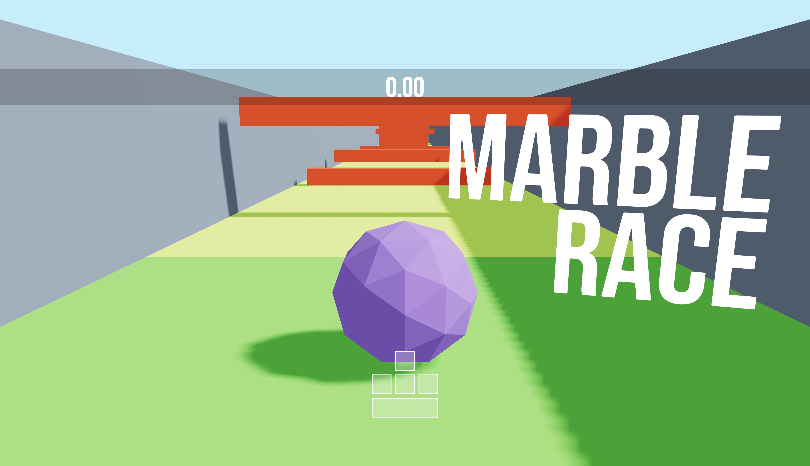

# 🌟 3D Marble Race Game 🌟

Welcome to the 3D Marble Race Game! This is a high-speed, action-packed game where you control a marble to get to a golden star as fast as you can. ⏱️ Navigate through tricky obstacles and try to beat the clock! 🏁



## 🎮 How to Play

1. **Clone this Repository**
    ```bash
    git clone https://github.com/yourusername/3D-Marble-Race-Game.git
    ```

2. **Navigate to the Project Folder**
    ```bash
    cd 3D-Marble-Race-Game
    ```

3. **Install Dependencies**
    ```bash
    npm install
    ```

4. **Run the Development Server**
    ```bash
    npm run dev
    ```

5. **Open the Game**: Open your web browser and navigate to `http://localhost:3000` to start playing!

## 🎯 Game Objective

- Control the marble using your keyboard. 
- Navigate through various obstacles and challenges.
- Reach the golden star to complete the level.
- Try to get the fastest time possible!

## 📈 Future Developments

- Multiplayer functionality
- Additional levels
- Leaderboard with global high scores

## Technologies Used

- Three.js
- React.js
- react-three-fiber
- Zustand

---

Happy Gaming! 🎮 🌟
